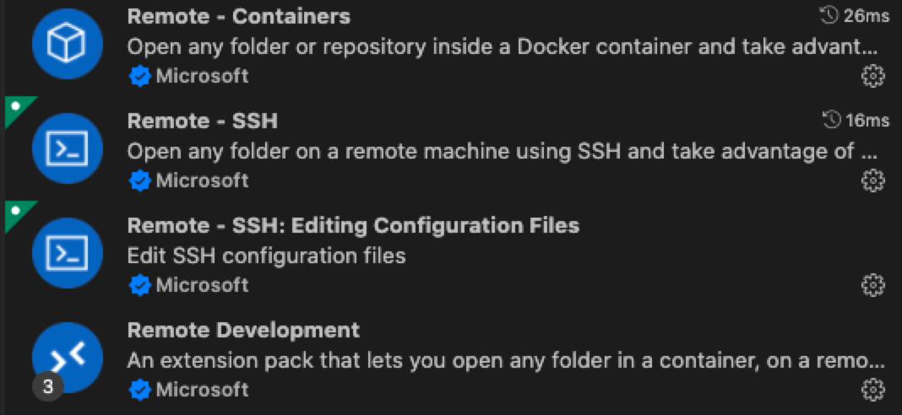
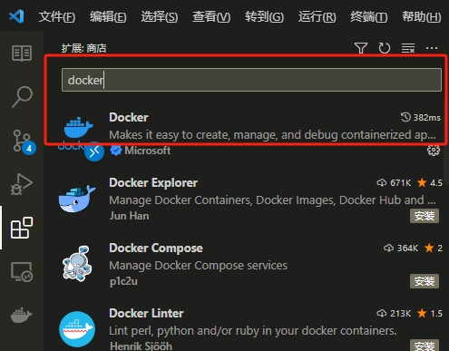
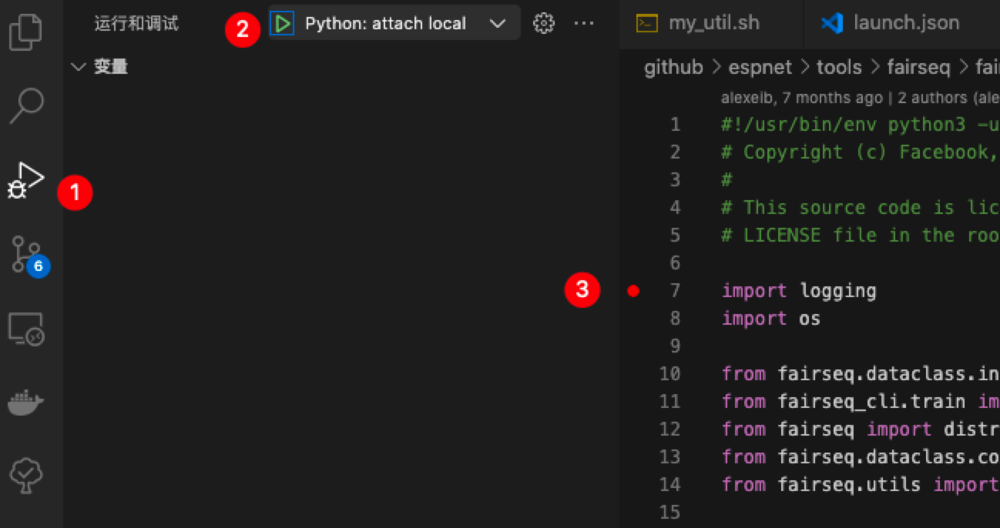
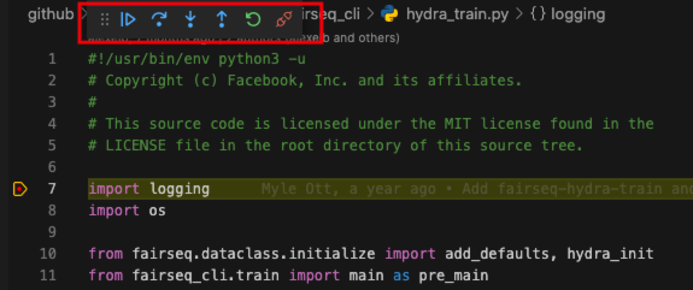

# An Intro to set up your Docker environment and debug using VSCode

> Created by zym22 on 2021.12.20
>
> Updated by Zhikang Niu on 2023/11/28
>
> Based on SJTU-XLANCE Servers & Speech Pre-train Docker as examples. 


## Set up VSCode Remote

1. Download extensions in VSCode. 



2. Set up config of multi-jumps. (For you need a jumping machine to get access the GPUs.) 

```bash
# local at ~/.ssh/config
Host gauss
    HostName 202.xxx.xxx.xxx
    Port 5566
    User zym22
Host date
    HostName 192.xxx.xxx.xxx
    # ProxyJump gauss
    ProxyCommand ssh -A gauss -W %h:%p
    User zym22
```

3. Connect to the Server such as `date`. 


## Set up Docker environment

> Before take steps in this section, make sure your terminal is like `zhikangniu@xxxxxx:~$`.

1. Set up Docker environment in `zhikangniu@xxxxxx:~$`.

```bash
docker pull zkniu/fairseq:torch1.12-cu113-fairseq
docker run -it --gpus all --name fairseq \
    -v /home/v-zhikangniu:/root \
    zkniu/fairseq:torch1.12-cu113-fairseq0.12 /bin/bash
docker start fairseq
docker exec -it fairseq /bin/bash
```

2. Install docker extension in VSCODE

   

3. Check docker container in your machine

   if successfully, you will see the following interface.

   > If you encounter some permission bug -> check : https://blog.csdn.net/weixin_44583856/article/details/120757864

   

​	

4. connect your container

   

## Debug using VSCode

> Before take steps in this section, make sure your terminal is like `root@xxxxx:~$`

1. Create a `launch.json` in `.vscode` folder.

```json
# launch.json
{
    // Use IntelliSense to learn about possible attributes.
    // Hover to view descriptions of existing attributes.
    // For more information, visit: https://go.microsoft.com/fwlink/?linkid=830387
    "version": "0.2.0",
    "configurations": [
        {
            "name": "Python: Attach",
            "type": "python",
            "request": "attach",
            "connect": {
              "host": "localhost",
              "port": 5678
            },
            "justMyCode": true,
          }
    ]
}
```

2. Run a python file and block.

```bash
pip install debugpy
python -m debugpy --listen 5678 --wait-for-client main.py args
# An example to debug wav2vec2.0 using fairseq.
python -m debugpy --listen 5678 --wait-for-client ../miniconda3/envs/espnet/bin/fairseq-hydra-train task.data=examples/wav2vec/manifest --config-dir examples/wav2vec/config/pretraining --config-name wav2vec2_test_librispeech

# you can also add alias in your .bashrc
# alias pyd='python -m debugpy --wait-for-client --listen 5678'
# pyd main.py args
# pyd ../miniconda3/envs/espnet/bin/fairseq-hydra-train task.data=examples/wav2vec/manifest --config-dir examples/wav2vec/config/pretraining --config-name wav2vec2_test_librispeech
```

3. Start debugging mode.






## About the Speech Pre-train Docker (Latest tag: 2023/11/28)

> A docker for Speech, compatible with fairseq.

Basic environment：11.3.1-cudnn8-devel-ubuntu20.04

- ubuntu=20.04 
- cudnn=8 cuda=11.3.1
- python=3.9 torch=1.12.1 torchaudio=0.13.1
- if you change the fairseq source code, you need to **pip install --editable ./**
